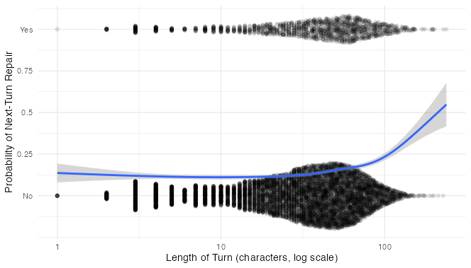

# Predicting Questions in Dialogue

A sample dialogue from the Minecraft Corpus:

> _(1) **Architect:** start with a stack of 5 purple blocks in the middle_
> 
> __(2) **Builder:** Now what?__
> 
> _(3) **Architect:** cool! extend the top purple block to a row of 5 purple blocks_
> 
> _(4) **Architect:** so like an upside down "L"__
> 
> __(5) **Builder:** So they should extend to one side, correct?__
> 
> _(6) **Architect:** yep!_
> 
> _(7) **Architect:** nice! now, put a block above and below the second block from the right_
> 
> __(8) **Builder:** What color should those blocks be?__

All three of the Builder's turns in this dialogue (lines 2, 5, and 8) are questions. They have some qualities in common: they all request something of the interlocutor, and they all signal their status as questions with a `question mark` at the end. This latter feature makes them easy to identify with one line of code: 
```r
minecraftcorpusdf %>% mutate(questionmark = grepl("\\?", text))
```
What causes people to ask questions in the Minecraft collaborative building task? Let's start by thinking about the Builder's questions from the excerpt above. 

The question on line 2, "Now what?" does not have an obvious antecedent - the Builder seems to have understood and excecuted the previous instruction and is now merely moving the conversation along by asking for another one.

The questions on lines 5 and 8, on the other hand, do have clear antecedents in the conversation. Specifically, they each refer to the architect's immediately preceding instruction and request clarification thereof. These questions can therefore be considered [repair initiations](https://onlinelibrary.wiley.com/doi/full/10.1111/tops.12339), turns in talk that identify trouble (i.e. a need for clarification) in a preceding turn or turns uttered by an interlocutor.

Hence the first theoretical answer to my question: What causes people to ask questions? The need for clarification.

Of course not all questions are repair initiations, and not all repair initiations are presented as questions. Nevertheless, the structure of the Minecraft collaborative building task makes the correlation very high. In the task, the Architect has access to _all_ of the information that the Builder needs to proceed (the design of the target structure) and information is the _only_ thing that the Builder can get from the Architect. This means that pretty much all of the Builder's questions are aimed at clarifying information coming from the Architect. 

For these reasons, and since I have no way of identifying true repair iniitations other than going through the whole corpus myself, I will operationally define `repair` as any Builder's utterance that includes a question mark.

```r
minecraftcorpusdf %>% mutate(repair = questionmark & role == "B")
```

To convince you that almost all Builder questions in the corpus really are repair initiations, here are 10 randomly selected repairs:
```r
minecraftcorpusdf %>%
  filter(repair == TRUE) %>%
  select(text) %>%
  sample_n(10)
  
#> 1785    like that?
#> 4312    like so? or like that?
#> 14821   Are they on the ground?
#> 15121   here?
#> 628     like that?
#> 3642    ooooh like this?
#> 1571    it might be easier to describe all one color? then build from there?
#> 182     is the purple supposed to be on the third level? i think i could make it float..
#> 12521   Facing towards the middle?
#> 2951    is this correct?
```
Even without looking at context, it seems clear at a glance that all but line 1571 here are indeed repairs.
Time to look at a few predictor variables.

```r
collapseturns <- function(convdf) {
  trashrows <- c()
  for(row in 2:nrow(convdf)){
    if(convdf[row, "participant"] == convdf[row - 1L, "participant"] & 
       convdf[row, "conversation"] == convdf[row - 1L, "conversation"]){
      convdf[row, "text"] <- paste(convdf[row - 1L, "text"], convdf[row, "text"])
      trashrows <- append(trashrows, row - 1L)
    }
  }
  convdf <- convdf[!(1:nrow(convdf) %in% trashrows), ]
  convdf
}

#### Additional Variables
# Orthographic Length of Previous Turn
# Mean TF-IDF of previous turn (word-fanciness? information density?)
# Total TF-IDF of previous turn (lexical complexity? information?)
# Turns since last question asked
# Total characters since last question asked

d1 <- collapseturns(minecraftcorpusdf)

d1$prevlength <- rep(0, nrow(d1))
d1$prevtfidfmean <- rep(0, nrow(d1))
d1$prevtfidfsum <- rep(0, nrow(d1))
d1$turnssincerepair <- rep(0, nrow(d1))
d1$charssincerepair <- rep(0, nrow(d1))
turnssincerepair <- 0L
charssincerepair <- 0L

for (n in 2:nrow(d1)) {
  if(d1$session[n-1L] == d1$session[n]) {
    d1$prevlength[n] <- d1$length[n-1L]
    d1$prevtfidfmean[n] <- d1$tfidfmean[n-1L]
    d1$prevtfidfsum[n] <- d1$tfidfsum[n-1L]
  }else{
    turnssincerepair <- 0L
    charssincerepair <- 0L
  }
  d1$turnssincerepair[n] <- turnssincerepair
  d1$charssincerepair[n] <- charssincerepair
  if(d1$repair[n] == TRUE & d1$role[n] == "B"){
    turnssincerepair <- 0L
    charssincerepair <- 0L
  }
  turnssincerepair <- turnssincerepair + 1L
  charssincerepair <- charssincerepair + d1$length[n]
}

# Repair as Factor, + Case Index
d1 <- d1 %>%  
  mutate(repair  = factor(repair, levels = c(FALSE, TRUE)),
         case = factor(1:n()))

# Remove first line of each conversation
# Subset only Builder turns
# Transform and Standardize variables
d1 <- d1 %>%
  filter(turnssincerepair != 0, 
         prevtfidfsum != 0, 
         charssincerepair != 0,
         role == "B") %>%
  mutate(charssincerepair_s = (charssincerepair-mean(charssincerepair, na.rm = T))/sd(charssincerepair, na.rm = T),
         turnssincerepair_s = (turnssincerepair-mean(turnssincerepair, na.rm = T))/sd(turnssincerepair, na.rm = T),
         prevtfidfsum_log = log(prevtfidfsum),
         prevtfidfsum_log_s = (prevtfidfsum_log-mean(prevtfidfsum_log, na.rm = T))/sd(prevtfidfsum_log, na.rm = T))
```

## Length of Previous Turn

I have already theorized that the likelihood of a given Builder turn being a repair initiation is increased by the need for clarification of previous turns. Are there certain types of instructions that need to be clarified more often? How about long and complicated ones?

Here's a quick and dirty graph of repair against length of the previous turn, with repair formaatted as numeric and a [Loess](https://en.wikipedia.org/wiki/Local_regression) line running between No and Yes:

```r
library(ggbeeswarm)

d1 %>%
  ggplot(aes(prevlength, (as.numeric(repair)-1))) +
    geom_quasirandom(method = "pseudorandom", 
                     width = .2,
                     groupOnX = F, 
                     alpha = .1, 
                     varwidth = T) +
    geom_smooth() +
    scale_x_continuous(trans = "log10") +
    scale_y_continuous(breaks = c(0, .25, .5, .75, 1),
                       labels = c("No", .25, .5, .75, "Yes")) +
    labs(x = "Length of Previous Turn (characters, log scale)",
         y = "Question") +
    theme_minimal()
```



Looks promising! It's hard to tell just by looking at the data points, but the regression line seems to think that longer previous turns are associated wih more repairs (the line goes the opposite direction at either extreme on the x axis, but I'm not taking that very seriously - the standard error in grey shows that [the model is not taking it too seriously either](https://youtu.be/QiHKdvAbYII?t=4230)). We might do a bit better if, rather than counting the number of characters, we had a measure more closely related to how much information is being conveyed. TF-IDF (Term Frequency * Inverse Document Frequency) fits the bill. 


