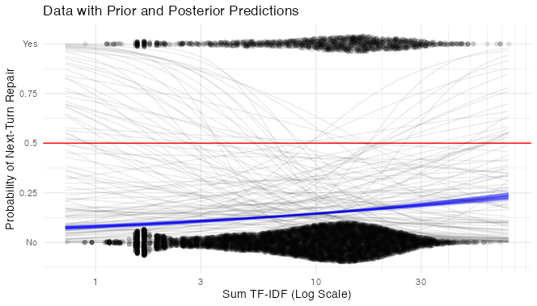
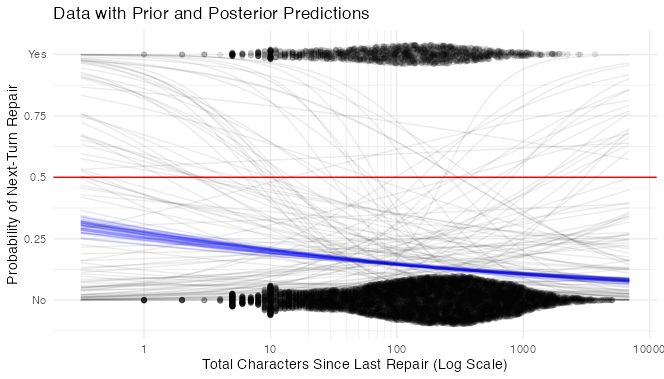

# Predicting Questions in Dialogue

A sample dialogue from the Minecraft Corpus:

> _(1) **Architect:** start with a stack of 5 purple blocks in the middle_
> 
> __(2) **Builder:** Now what?__
> 
> _(3) **Architect:** cool! extend the top purple block to a row of 5 purple blocks_
> 
> _(4) **Architect:** so like an upside down "L"__
> 
> __(5) **Builder:** So they should extend to one side, correct?__
> 
> _(6) **Architect:** yep!_
> 
> _(7) **Architect:** nice! now, put a block above and below the second block from the right_
> 
> __(8) **Builder:** What color should those blocks be?__

All three of the Builder's turns in this dialogue (lines 2, 5, and 8) are questions. They have some qualities in common: they all request something of the interlocutor, and they all signal their status as questions with a `question mark` at the end. This latter feature makes them easy to identify with one line of code: 
```r
minecraftcorpusdf %>% mutate(questionmark = grepl("\\?", text))
```
What causes people to ask questions in the Minecraft collaborative building task? Let's start by thinking about the Builder's questions from the excerpt above. 

The question on line 2, "Now what?" does not have an obvious antecedent - the Builder seems to have understood and excecuted the previous instruction and is now merely moving the conversation along by asking for another one.

The questions on lines 5 and 8, on the other hand, do have clear antecedents in the conversation. Specifically, they each refer to the architect's immediately preceding instruction and request clarification thereof. These questions can therefore be considered [repair initiations](https://onlinelibrary.wiley.com/doi/full/10.1111/tops.12339), turns in talk that identify trouble (i.e. a need for clarification) in a preceding turn or turns uttered by an interlocutor.

Hence the first theoretical answer to my question: What causes people to ask questions? The need for clarification.

Of course not all questions are repair initiations, and not all repair initiations are presented as questions. Nevertheless, the structure of the Minecraft collaborative building task makes the correlation very high. In the task, the Architect has access to _all_ of the information that the Builder needs to proceed (the design of the target structure) and information is the _only_ thing that the Builder can get from the Architect. This means that pretty much all of the Builder's questions are aimed at clarifying information coming from the Architect. 

For these reasons, and since I have no way of identifying true repair iniitations other than going through the whole corpus myself, I will operationally define `repair` as any Builder's utterance that includes a question mark.

```r
minecraftcorpusdf %>% mutate(repair = questionmark & role == "B")
```

To convince you that almost all Builder questions in the corpus really are repair initiations, here are 10 randomly selected repairs:
```r
minecraftcorpusdf %>%
  filter(repair == TRUE) %>%
  select(text) %>%
  sample_n(10)
  
#> 1785    like that?
#> 4312    like so? or like that?
#> 14821   Are they on the ground?
#> 15121   here?
#> 628     like that?
#> 3642    ooooh like this?
#> 1571    it might be easier to describe all one color? then build from there?
#> 182     is the purple supposed to be on the third level? i think i could make it float..
#> 12521   Facing towards the middle?
#> 2951    is this correct?
```
Even without looking at context, it seems clear at a glance that all but line 1571 here are indeed repairs.

## How to Predict Repair
Before I start exploring predictor variables, I need to figure out how to model the probability of repair. My first instinct was just to subset out all of the Builder turns and model whether of not they are repairs. There's a fatal flaw with this plan though: the natural alternative to _initiating repair_ is probably not _initiating something other than repair_. The alternative is more likely to be _not saying anything_. In other words, we only have data about whether or not texts the Builder _sent_ were repairs. We have no data about texts the Builder _didn't send_. 

I'll draw that more formally as a DAG:
```r
library(ggdag)
# Length -> TF-IDF Sum -> Probability of Repair -> Question Mark at End
# Turns since Last Repair -> Probability of Repair -> Question Mark at End
dag_coords_0 <-
  tibble(name = c("C", "U", "R", "Q"),
         x    = c(1, 2, 3, 4),
         y    = c(2, 2, 2, 2))

dagify(U ~ C,
       R ~ U,
       Q ~ R,
       coords = dag_coords_0) %>%
  dag_label(labels = c("C" = "?", 
                       "U" = str_wrap("Builder Responds", 10), 
                       "R" = "Repair", 
                       "Q" = str_wrap("Question Mark", 10))) %>%
  ggplot(aes(x = x, y = y, xend = xend, yend = yend)) +
  geom_dag_point(aes(color = name == "R"),
                 alpha = 1/2, size = 20, show.legend = F) +
  geom_dag_text(aes(label = label, size = name == "C"), color = "black") +
  scale_x_continuous(NULL, breaks = NULL, expand = c(.1, .1)) +
  scale_y_continuous(NULL, breaks = NULL, expand = c(.1, .1)) +
  scale_size_manual(guide = NULL, values = c(2.5, 5)) +
  geom_dag_edges() +
  theme_dag()
```
!(? -> Builder Responds -> Probability of Repair -> Question Mark at End)[figures/minecraft5.png]

`as yet undiscussed predictors` predict whether or not the Builder will respond to an instruction from the Architect. Whether or not the Builder responds predicts whether the response will be a repair initiation (if the Builder doesn't respond there's zero probability of the response being anything). Finally, the responses status as a repair initiation influences our proxy variable, `the presence of a question mark`.

All of this means that my inital stategy would probably wash out any effect of predictors on repair, since [we would already be stratifying by whether the Builder responds](https://youtu.be/YrwL6t0kW2I?t=864). Since we can't measure the absence of repair, I think the best solution is to collapse adjacent turns by the same participant so that the Builder always speaks after the Architect, and vice versa. 

For example, this conversation:

> _(2) **Builder:** Now what?_
> 
> _(3) **Architect:** cool! extend the top purple block to a row of 5 purple blocks_
> 
> _(4) **Architect:** so like an upside down "L"__

...would turn into this:

> _(2) **Builder:** Now what?_
> 
> _(3) **Architect:** cool! extend the top purple block to a row of 5 purple blocks so like an upside down "L"_

This was [Duran & Paxton's (2019)](https://doi.org/10.1037/met0000206) approach to a similar problem. It ensures that there will always be a next-turn Builder response of some sort. If the Builder types nothing, the Architect's next turn will just get smushed onto his last one. This also has the helpful effect of eliminating variability in the frequency with which people like to press "send" while texting. The only upshot is that we can no longer understand one case as one turn - it might be a few.

```r
collapseturns <- function(convdf, aggregate, method, dropcols = TRUE) {
  trashrows <- c()
  for(row in 2:nrow(convdf)){
    if(convdf[row, "participant"] == convdf[row - 1L, "participant"] & 
       convdf[row, "conversation"] == convdf[row - 1L, "conversation"]){
      convdf[row, "text"] <- paste(convdf[row - 1L, "text"], convdf[row, "text"])
      for(col in 1:length(aggregate)){
        if(method[col] == "sum"){
          convdf[row, aggregate[col]] <- convdf[row-1L, aggregate[col]] + convdf[row, aggregate[col]]
        }
        if(method[col] == "mean"){
          convdf[row, aggregate[col]] <- mean(c(convdf[row-1L, aggregate[col]], convdf[row, aggregate[col]]), na.rm = T)
        }
        if(method[col] == "any"){
          convdf[row, aggregate[col]] <- any(convdf[row-1L, aggregate[col]], convdf[row, aggregate[col]])
        }
      }
      trashrows <- append(trashrows, row - 1L)
    }
  }
  convdf <- convdf[!(1:nrow(convdf) %in% trashrows), ]
  if(dropcols){
    convdf[, c("participant", "conversation", "text", aggregate)]
  }else{
    convdf
  }
}
```

Time to look at a few predictor variables.

```r
# Orthographic Length of Previous Turn
# Mean TF-IDF of previous turn (word-fanciness? information density?)
# Total TF-IDF of previous turn (lexical complexity? information?)
# Turns since last question asked
# Total characters since last question asked

d1 <- collapseturns(minecraftcorpusdf)
d1$prevlength <- rep(0, nrow(d1))
d1$prevtfidfmean <- rep(0, nrow(d1))
d1$prevtfidfsum <- rep(0, nrow(d1))
d1$charssincerepair <- rep(0, nrow(d1))
charssincerepair <- 0L

for (n in 2:nrow(d1)) {
  if(d1$session[n-1L] == d1$session[n]) {
    d1$prevlength[n] <- d1$length[n-1L]
    d1$prevtfidfmean[n] <- d1$tfidfmean[n-1L]
    d1$prevtfidfsum[n] <- d1$tfidfsum[n-1L]
  }else{
    charssincerepair <- 0L
  }
  d1$charssincerepair[n] <- charssincerepair
  if(d1$repair[n] == TRUE & d1$role[n] == "B"){
    charssincerepair <- 0L
  }
  charssincerepair <- charssincerepair + d1$length[n]
}

# Repair as Factor, + Case Index
d1 <- d1 %>%  
  mutate(repair  = factor(repair, levels = c(FALSE, TRUE)),
         case = factor(1:n()))

# Remove first line of each conversation
# Subset only Builder turns
# Transform and Standardize variables
d1 <- d1 %>%
  filter(turnssincerepair != 0, 
         prevtfidfsum != 0, 
         charssincerepair != 0,
         role == "B") %>%
  mutate(charssincerepair_log = log(charssincerepair),
         charssincerepair_log_s = (charssincerepair_log-mean(charssincerepair_log, na.rm = T))/sd(charssincerepair_log, na.rm = T),
         prevtfidfsum_log = log(prevtfidfsum),
         prevtfidfsum_log_s = (prevtfidfsum_log-mean(prevtfidfsum_log, na.rm = T))/sd(prevtfidfsum_log, na.rm = T))
```

## Length of Previous Turn

I have already theorized that the likelihood of a given Builder turn being a repair initiation is increased by the need for clarification of previous turns. Are there certain types of instructions that need to be clarified more often? How about long and complicated ones?

Here's a quick and dirty graph of repair against `length of the previous turn`, with `repair` formaatted as numeric and a [Loess](https://en.wikipedia.org/wiki/Local_regression) line running between No and Yes:

```r
library(ggbeeswarm)

d1 %>%
  ggplot(aes(prevlength, (as.numeric(repair)-1))) +
    geom_quasirandom(method = "pseudorandom", 
                     width = .2,
                     groupOnX = F, 
                     alpha = .1, 
                     varwidth = T) +
    geom_smooth() +
    scale_x_continuous(trans = "log10") +
    scale_y_continuous(breaks = c(0, .25, .5, .75, 1),
                       labels = c("No", .25, .5, .75, "Yes")) +
    labs(x = "Length of Previous Turn (characters, log scale)",
         y = "Question") +
    theme_minimal()
```


Looks promising! It's hard to tell just by looking at the data points, but the regression line seems to think that longer previous turns are associated wih more repairs (the line goes the opposite direction at the extremes on the x axis, but I'm not taking that very seriously - the standard error grey area is wide and [the model is stupid](https://youtu.be/QiHKdvAbYII?t=4230)). 

We might do a bit better if, rather than counting the number of characters, we had a measure more closely related to how much information is being conveyed. TF-IDF (Term Frequency * Inverse Document Frequency) fits the bill. The TF-IDF of a word describes how rare it is in the whole corpus vs. how common it is in its own turn. Presumably, rarer words are less predictable and therefore more informative and more confusing. The `sum of TF-IDF scores` of all words in an turn should tell us something about how much new semantic material is included in each turn.


This looks similar to the first one. Indeed, `Previous turn TF-IDF Sum` and `Previous turn length` are correlated in the corpus at r = .991. Nevertheless, I'm going to stick with TF-IDF Sum because it makes more sense to me as a theoretical predictor.

### Bayesian Modeling

I'll start by simulating reasonable priors. I'll let the slope be positive or negative. About half of Builder turns are repairs, so I'll keep the means at zero. After playing around with the parameters a bit, I settled on this:

```r
# Simulating Reasonable Priors
d1 %>%
  group_by(repair) %>%
  summarise(perc = 100*n()/nrow(.))   # 51.9% of collapsed builder turns are repairs

priors <- 
  tibble(n = 1:50,
         a = rnorm(50, 0, 1),
         b = rnorm(50, 0, 1)) %>% 
  expand(nesting(n, a, b), x = seq(from = -3, to = 3, length.out = 200)) %>% 
  mutate(p = inv_logit_scaled(a+b*x)) %>%
  arrange(n) %>%
  mutate(n = factor(n)) 
priors %>%
  ggplot(aes(x, p, group = n)) +
  geom_line(alpha = .5)
```

Let's set up the model.

```r
library(brms)
library(tidybayes)

prevtfidf_mod <- brm(
  repair ~ 1 + prevtfidfsum_log_s,
  data = d1,
  family = bernoulli,
  prior = c(prior(normal(0, 1), class = Intercept),
            prior(normal(0, 1), class = b)),
  sample_prior = "yes")
```

Here's the model summary:

```r
print(prevlength_mod)
```
```
## Family: bernoulli 
##  Links: mu = logit 
## Formula: repair ~ 1 + prevlength_log_s 
##   Data: d1 (Number of observations: 3565) 
##  Draws: 4 chains, each with iter = 2000; warmup = 1000; thin = 1;
##         total post-warmup draws = 4000
##
## Population-Level Effects: 
##                 Estimate Est.Error l-95% CI u-95% CI Rhat Bulk_ESS Tail_ESS
## Intercept            0.07      0.03     0.01     0.14 1.00     3310     2707
## prevlength_log_s     0.21      0.03     0.14     0.27 1.00     3393     2670
##
## Draws were sampled using sampling(NUTS). For each parameter, Bulk_ESS
## and Tail_ESS are effective sample size measures, and Rhat is the potential
## scale reduction factor on split chains (at convergence, Rhat = 1).
```

Now I can sample the posteriors and see what the models thinks.

```r
# Sample Prior and Posterior
prevtfidf_mod_priors <- as_draws_df(prevtfidf_mod, c("prior_Intercept", "prior_b"))[1:100,] %>%
  as_tibble() %>%
  mutate(n = factor(1:100)) %>%
  expand(nesting(n, prior_Intercept, prior_b), x_log_s  = seq(from = -2.5, to = 3, length.out = 200)) %>%
  mutate(p = inv_logit_scaled(prior_Intercept+prior_b*x_log_s),
         x_log = x_log_s * sd(d1$prevtfidfsum_log) + mean(d1$prevtfidfsum_log),
         x = exp(x_log))

n_iter <- 50
prevtfidf_mod_fitted <-
  fitted(prevtfidf_mod,
         newdata  = tibble(prevtfidfsum_log_s = seq(from = -2.5, to = 3, length.out = 200)),
         summary  = F,
         nsamples = n_iter) %>% 
  as_tibble() %>%
  mutate(iter = 1:n_iter) %>% 
  pivot_longer(-iter) %>% 
  mutate(prevtfidf_log_s = rep(seq(from = -2.5, to = 3, length.out = 200), times = n_iter)) %>% 
  mutate(prevtfidf_log = prevtfidf_log_s * sd(d1$prevtfidfsum_log) + mean(d1$prevtfidfsum_log),
         prevtfidf = exp(prevtfidf_log_s * sd(d1$prevtfidfsum_log) + mean(d1$prevtfidfsum_log)))


prevtfidf_mod_postpredict <- prevtfidf_mod_fitted %>%
  ggplot(aes(x = prevtfidf)) +
    geom_hline(yintercept = .5, color = "red") +
    geom_line(aes(y = value, group = iter), color = "blue", alpha = .1) +
    geom_line(data = prevtfidf_mod_priors,
              aes(x, p, group = n), color = "black", alpha = .08) + 
    geom_quasirandom(data = d1,
                     aes(x = prevtfidfsum,
                         y = as.integer(repair)-1),
                     alpha = 1/10,
                     groupOnX = F,
                     width = 1/10,
                     method = "pseudorandom",
                     varwidth = T) +
    scale_x_continuous(trans = "log10", minor_breaks = seq(10, 100, by = 10)) +
    scale_y_continuous(breaks = c(0, .25, .5, .75, 1),
                       labels = c("No", .25, .5, .75, "Yes")) +
    labs(title = "Data with Prior and Posterior Predictions",
         y = "Question", 
         x = "Sum TF-IDF of Previous Turn (Log Scale)") +
    theme_minimal()

prevtfidf_mod_postpredict
```

The faint grey lines are 100 samples from the prior distribution. In blue are 50 samples from the posterior. 



The posterior predictions look like a straight line on the logarithmic scale - for very short, simple instructions from the Architect, the Builder's response is most likely not to be a repair. As total TF-IDF goes up, the probability of repair does too, at first rapidly, them more slowly.

## Time Since Last Repair

As described in [Dingemanse et al. (2015)](https://doi.org/10.1371/journal.pone.0136100.g002), another predictor of repair is the time elapsed since the last repair. People don't tend to initiate repair twice in a row. In lieu of using actual timestamps, I'll use the total number of characters typed as a proxy for time elapsed. I'll use the same priors as before.

```r
charssincerepair_mod <- brm(
  repair ~ 1 + charssincerepair_log_s,
  data = d1,
  family = bernoulli,
  prior = c(prior(normal(-1, 1), class = Intercept),
            prior(normal(0, 1), class = b)),
  sample_prior = "yes")
```
```r
print(charssincerepair_mod)
```
```
##  Family: bernoulli 
##   Links: mu = logit 
## Formula: repair ~ 1 + charssincerepair_log_s 
##    Data: d1 (Number of observations: 3564) 
##   Draws: 4 chains, each with iter = 2000; warmup = 1000; thin = 1;
##          total post-warmup draws = 4000
## 
## Population-Level Effects: 
##                        Estimate Est.Error l-95% CI u-95% CI Rhat Bulk_ESS Tail_ESS
## Intercept                  0.07      0.03     0.01     0.14 1.00     3632     2499
## charssincerepair_log_s     0.16      0.03     0.09     0.22 1.00     3207     2690
## 
## Draws were sampled using sampling(NUTS). For each parameter, Bulk_ESS
## and Tail_ESS are effective sample size measures, and Rhat is the potential
## scale reduction factor on split chains (at convergence, Rhat = 1).
```

```r
charssincerepair_mod_priors <- as_draws_df(charssincerepair_mod, c("prior_Intercept", "prior_b"))[1:100,] %>%
  as_tibble() %>%
  mutate(n = factor(1:100)) %>%
  expand(nesting(n, prior_Intercept, prior_b), x_log_s  = seq(from = -4, to = 2.63, length.out = 200)) %>%
  mutate(p = inv_logit_scaled(prior_Intercept+prior_b*x_log_s),
         x_log = x_log_s * sd(d1$charssincerepair_log) + mean(d1$charssincerepair_log),
         x = exp(x_log))

n_iter <- 50
charssincerepair_mod_fitted <-
  fitted(charssincerepair_mod,
         newdata  = tibble(charssincerepair_log_s = seq(from = -4, to = 2.63, length.out = 200)),
         summary  = F,
         nsamples = n_iter) %>% 
  as_tibble() %>%
  mutate(iter = 1:n_iter) %>% 
  pivot_longer(-iter) %>% 
  mutate(charssincerepair_log_s = rep(seq(from = -4, to = 2.63, length.out = 200), times = n_iter)) %>% 
  mutate(prevtfidf_log = charssincerepair_log_s * sd(d1$charssincerepair_log) + mean(d1$charssincerepair_log),
         charssincerepair = exp(charssincerepair_log_s * sd(d1$charssincerepair_log) + mean(d1$charssincerepair_log)))


charssincerepair_mod_postpredict <- charssincerepair_mod_fitted %>%
  ggplot(aes(x = charssincerepair)) +
  geom_hline(yintercept = .5, color = "red") +
  geom_line(aes(y = value, group = iter), color = "blue", alpha = .1) +
  geom_line(data = charssincerepair_mod_priors,
            aes(x, p, group = n), color = "black", alpha = .08) + 
  geom_quasirandom(data = d1,
                   aes(x = charssincerepair,
                       y = as.integer(repair)-1),
                   alpha = 1/10,
                   groupOnX = F,
                   width = 1/10,
                   method = "pseudorandom",
                   varwidth = T) +
  scale_x_continuous(trans = "log10", minor_breaks = seq(10, 100, by = 10)) +
  scale_y_continuous(breaks = c(0, .25, .5, .75, 1),
                     labels = c("No", .25, .5, .75, "Yes")) +
  labs(title = "Data with Prior and Posterior Predictions",
       y = "Question", 
       x = "Total Characters Since Last Repair (Log Scale)") +
  theme_minimal()

charssincerepair_mod_postpredict
```



Sure Enough!
